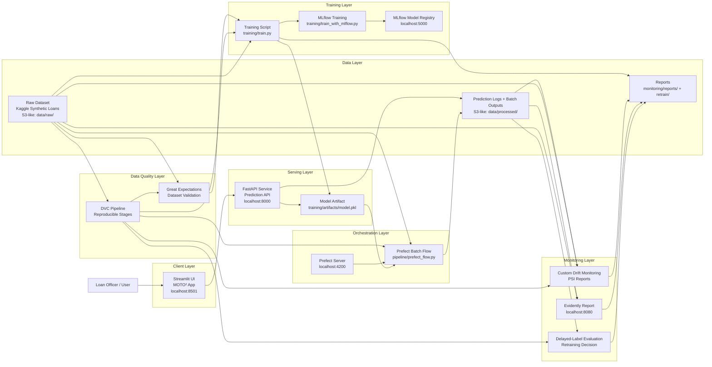

## Section 9 - Reflection

### What Worked Well

**Label latency modeling** was the most technically rewarding decision we made. Rather than naively using all 5,000 rows, we filtered to only the 3,934 loans that had reached their D3 maturity window, ensuring that every training example had a ground-truth default label. This prevented a subtle but serious data leakage pattern that would have inflated our metrics. Most default prediction models in student projects skip this entirely.

**The synthetic Philippine dataset** gave us full control over feature distributions and allowed us to build a use case that was culturally grounded. By basing the schema on a real two-wheeler loan origination system from a Southeast Asian bank, the features -- informal occupation types, living-with-parents residence status, no-bureau-history borrowers -- reflected the actual Philippine lending landscape rather than a generic Western credit dataset.

**SHAP explainability** turned out to be one of the strongest elements of the demo. Being able to show Mang Tony not just a decision but a plain-language explanation of why he was approved or flagged made the system feel real and trustworthy. In lending, explainability is not optional -- regulators and borrowers have the right to understand decisions made about them.

**MLflow model registry with v1 to v2 promotion** worked exactly as designed. The retraining flow compared the AUC of the newly trained model against the production model before promoting it, ensuring we never deploy a worse model. Seeing v1 transition to Archived and v2 to Production during the live demo was one of the most visually compelling moments of the presentation.

**Prefect as the orchestration layer** was the right choice for our timeline. Its Python-native API meant we could wrap existing functions as tasks without rewriting logic, and the Prefect UI gave the panel a clear visual of every step that fired during Mang Tony's application -- ingestion, validation, scoring, explanation, and logging -- all in a single flow run.

**The drift simulator** was a deliberate design decision that paid off in the demo. By sending 200 synthetic applications with shifted distributions -- older borrowers, lower incomes, more informal workers -- we were able to trigger the Evidently monitoring dashboard live and show the retraining flow responding automatically. This made Arc 3 of the demo genuinely dynamic rather than pre-recorded.

---

### What Failed or Fell Short

**SHAP integration with XGBoost 3.2.0** was the most painful debugging experience of the project. The `[5E-1]` base score parsing error between SHAP 0.48.0 and XGBoost 3.2.0 cost us several hours. The fix -- downgrading to XGBoost 2.1.1 -- was simple but non-obvious. We learned to pin dependency versions explicitly from the start, not after hitting compatibility walls.

**The threshold decision** was harder than expected. The default threshold of 0.50 produced a recall of only 0.50 -- meaning we missed half of all actual defaulters. Tuning down to 0.35 improved recall to 0.67 but at the cost of precision. In a real lending system, this tradeoff would require input from the business on the relative cost of false negatives versus false positives. We made a reasonable assumption but a real deployment would require empirical calibration on live data.

**DVC integration** was added late in the project. While the dvc.yaml pipeline and `dvc repro` command work correctly, we did not have time to configure a remote DVC storage backend. Data versioning currently relies on the seeded synthetic data generator and the Kaggle dataset URL for reproducibility rather than true artifact tracking across versions.

**The Prefect UI does not show real-time per-request flow runs** from the FastAPI endpoint during the demo. The Prefect flow in `prefect_flow.py` runs as a batch scorer rather than a per-prediction trigger. For the demo, we run the flow manually to show pipeline visibility. In a production system, each API request would ideally trigger an observable Prefect flow run -- this would require deploying a Prefect worker and configuring deployments, which was outside our timeline.

---

### Lessons Learned

**Pin your dependencies on day one.** The XGBoost and SHAP version conflict was avoidable. A `requirements.txt` with exact version pins from the beginning would have prevented hours of debugging the night before the demo.

**Threshold tuning matters more than hyperparameter tuning.** Moving the decision threshold from 0.50 to 0.35 had a larger impact on recall than any hyperparameter change. For imbalanced classification problems in high-stakes domains like lending, threshold selection deserves as much attention as model selection.

**Label latency is not optional in real-world credit modeling.** A model trained on immature labels will appear to perform well in development but fail in production when real D3 outcomes arrive. The maturity filter is not a nice-to-have -- it is the difference between a model that works and one that does not.

**Demo reliability beats demo complexity.** We initially wanted to show every feature of every tool. By the time we rehearsed, we realized that a clean, focused 15-minute arc -- Mang Tony applies, the pipeline fires, drift triggers retraining, the registry updates -- was far more impactful than trying to show everything. We cut scope deliberately and the demo was stronger for it.

---

### Future Work

Given more time, we would prioritize the following improvements:

**Real borrower data validation.** The synthetic dataset captures the right distributions but a model trained on actual Philippine motorcycle loan data -- from a cooperative, rural bank, or microfinance institution -- would produce more reliable risk scores and allow proper backtesting against known default outcomes.

**Per-request Prefect flow runs.** Configuring a Prefect deployment with a dedicated worker would allow each API prediction to trigger a visible, logged flow run in the Prefect UI. This would make the pipeline observability story complete.

**PostgreSQL for prediction logging.** The current system logs predictions to a CSV file. This works for demonstration but does not support concurrent writes, indexing, or querying at scale. A proper database would be the first infrastructure upgrade in a real deployment.

**A/B testing between model versions.** Rather than fully promoting v2 to Production, a real deployment would route a percentage of traffic to v2 while keeping v1 active, comparing performance on live predictions before completing the promotion. MLflow supports this with model aliases.

**Authentication and access control.** The FastAPI endpoint is currently open with no authentication. A production API would require JWT tokens or API keys, especially given the sensitivity of loan applicant data under the Philippine Data Privacy Act.

**Fairness and bias auditing.** The optional governance section of the rubric touches on this. A full fairness audit would check whether the model performs equally well across gender, occupation type, and geographic region -- ensuring that informal workers in Mindanao are not systematically disadvantaged compared to Metro Manila applicants.

## AWS-Style MLOps Architecture

The project can be explained as an AWS-style MLOps architecture even though the
local implementation runs with Docker Compose. The diagram below maps the local
components to their cloud equivalents.

### AWS Service Mapping

| Local Component | AWS-Style Equivalent | Purpose |
| --- | --- | --- |
| `data/raw/` | Amazon S3 raw bucket | Stores source loan dataset |
| `data/processed/` | Amazon S3 processed bucket | Stores predictions and batch outputs |
| Great Expectations | AWS Glue Data Quality / Deequ-like validation | Validates schema and data quality |
| `training/train.py` | SageMaker Training Job | Trains the model on matured labels |
| `training/artifacts/model.pkl` | SageMaker Model Artifact / S3 model path | Stores trained model artifact |
| MLflow UI | SageMaker Experiments / MLflow on ECS | Tracks experiments and registered models |
| FastAPI container | ECS/Fargate or SageMaker Endpoint | Serves real-time predictions |
| Streamlit container | ECS/Fargate / App Runner | Hosts the user-facing app |
| Prefect | Step Functions / MWAA / EventBridge Scheduler | Orchestrates batch scoring workflows |
| Custom monitoring reports | CloudWatch dashboards / S3 reports | Tracks drift and prediction behavior |
| Evidently | Monitoring job on ECS/SageMaker Processing | Generates drift and data quality reports |
| Delayed-label evaluation | Scheduled batch evaluation job | Evaluates model once labels mature |
| DVC | CodePipeline + S3 versioned artifacts | Reproducible pipeline and artifact lineage |

### End-to-End Flow

1. The raw Kaggle synthetic motorcycle loan dataset lands in the raw data layer.
2. Great Expectations validates schema, ranges, categorical values, and label rules.
3. The training job uses only matured labels and excludes leakage columns.
4. The trained model artifact is saved and optionally registered in MLflow.
5. FastAPI loads the model and serves real-time predictions.
6. Streamlit sends loan applications to the FastAPI endpoint.
7. Predictions are logged with pending actual labels.
8. Prefect runs batch scoring for pending applications.
9. Custom monitoring and Evidently compare reference data against current logged predictions.
10. Delayed-label evaluation computes performance after outcomes mature.
11. The retraining decision report determines whether retraining is recommended.
